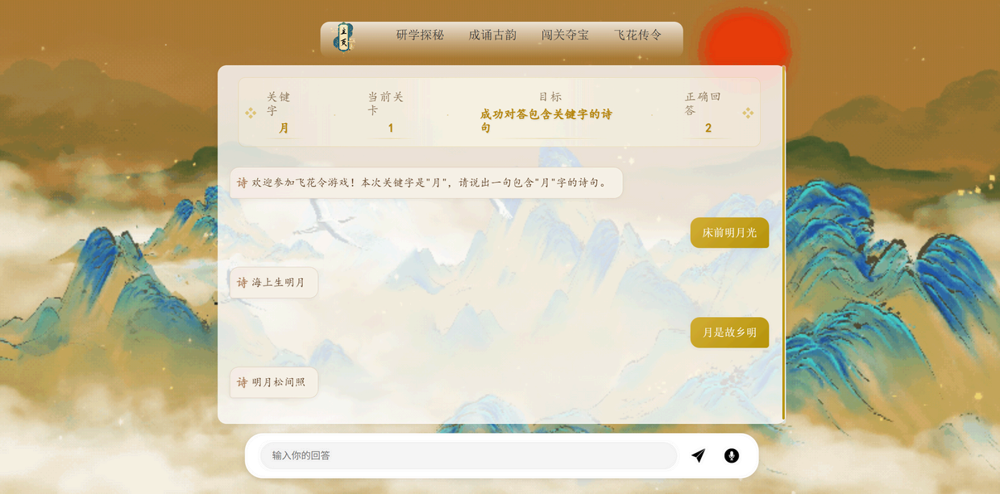

# 诗韵童行——基于多模态融合与深度学习的古诗词智能学习平台

## 项目概要

“诗韵童行”是⼀个专为4-12岁儿童设计的互动学习平台，旨在通过多模态交互（如语音、文本输入）提升古诗词学习的趣味性和效果。主要面向的用户群体是处于语言和认知能力发展关键时期的儿童。

## 创新价值

- 创新学习体验：本平台集成了先进的语音识别技术、引入大语言模型，打造沉浸式学习平台。
- 提升学习效果：通过融合多模态交互方式，本平台增强了学习的趣味性与互动性，从而有效提高了学习效率并促进了知识的深度掌握。
- 拓展学习资源：本平台整合了丰富的古诗词教育资源，为学生提供全面的学习支持，帮助其在多样化的学习内容中获得更多的知识与灵感。

## 项目介绍

### 主页

主页是用户进入平台后的第⼀个页面，包含“欢迎消息和四个学习模式的选择按钮 。还有每日诗词推荐帮助孩子记忆好诗。

### 研学探秘

用户可以通过语音或输入文本的方式来输入任何想了解的古诗词信息。数字人会带领会给出详细的介绍，包括涉及到的古诗、作者、时代背景、思想感情等信息，用户可以选择数字人形象。

### 成诵古韵

成诵古韵模式旨在帮助儿童记忆诗词，儿童可以通过重复背诵和自我测试来加强记忆。

### 闯关夺宝

闯关夺宝模式通过答题闯关增强儿童对诗词的记忆和理解。每个关卡包含不同难度的九宫格问题，儿童可以⾃由选择关卡。

### 飞花传令

主持人AI会随机给出⼀个关键词，用户需要输入包含该关键词的诗句。对战选手AI能够与玩家进行对战。

## 演示视频

<video id="video" controls=""src="./assets/video.mp4" preload="none">

